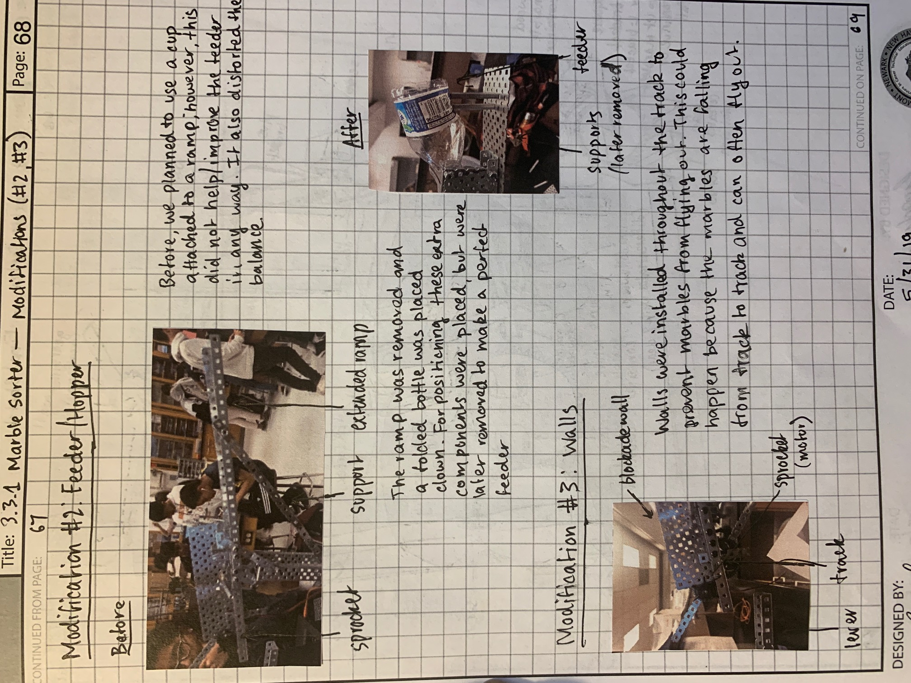

# Description
This marble sorter is a project where the objective was to sort between marbles of different materials. Using VEX robotic devices and sensors, the job is to separate the marbles of different materials completely.

# Solution

### Approach

Using the difference between material weights and colors, I decided to use a lever, line encoder, and light sensor to separate between the different types of marbles. The general course would be to test each marble one by one through each of these sensors. Here is a flowchart and general pseudocode:

### Modifications

Over the course of building, several modifications were made to complee the object more precisely.

### Final Designs

These are the final designs and sketches.

